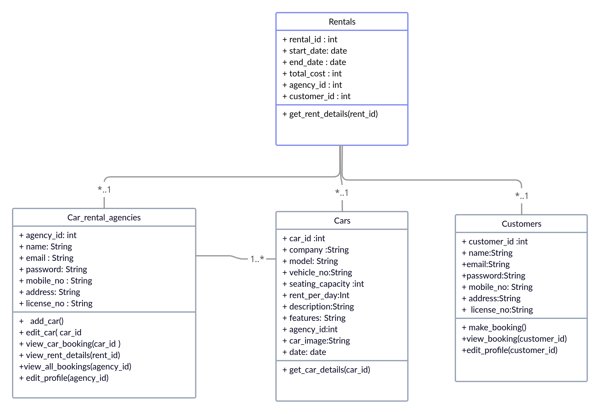

# Car Rental Website

A website that allows users to rent cars and car rental agencies to add cars for rent.

## Features
- Registration pages for customers and car rental agencies
- Login pages for customers and car rental agencies
- Add new cars page for car rental agencies to add details of new cars available for rental
- Available cars to rent page that displays all available cars to rent and allows customers to book them
- Car agency view booked cars page that allows agencies to see the list of customers who have booked their cars

## Technologies
- Front-end: HTML, CSS, JS (with Bootstrap)
- Backend: PHP
- Database: MySQL

## Requirements
- A web server (such as Apache)
- PHP and MySQL

## Installation
1. Download and extract the source code
2. Import the `car_rental.sql` file into your MySQL database
3. Update the database configuration in `application/config/database.php`
4. Upload the source code to your web server
5. Access the website through your web browser

## Usage
1. Register as a customer or car rental agency
2. Login to your account
3. If you are a car rental agency, you can add new cars for rent by clicking on the "Add New Cars" button
4. If you are a customer, you can browse and book available cars on the "Available Cars to Rent" page
5. If you are a car rental agency, you can view the list of customers who have booked your cars on the "View Booked Cars" page


#DATABASE SCHEMA




This class diagram shows :
Customers --* Rentals
CarRentalAgency --* Cars
Rentals --* Cars
Rentals --* CarRentalAgency


FILE STRUCTURE
```bash
├──── index.php   		[ landing page of the website ]        
├── config	   			[ utility functions folder ]
│   ├── database.php   			[ manages the connection with the database ]
│   └── functions.php				[ utility functions ]
 |
├── inc				[ includes folder - to contain common code for pages ]
│   ├── about.php   				[ about page of the website ]
│   ├── faq.php   				[ faq page of the website ]
│   ├── footer.php				[ common Html code for website footer ]
│   ├── header.php	   			[ common code for website header(navbar etc)]
│   ├── script.js
│   └── style.css
├── images				[ folder to contain images for the website]
 |
├── customer			[ folder for customer pages ]
│   ├── book_car.php			[ page for customers to book a car ]
│   ├── customer_login.php			[ customer login page ]	
│   ├── customer_logout.php		[ customer logout page (to destroy session) ]
│   ├── inc				[ includes folder to contain common code for pages ]
│   │   ├── footer.php
│   │   └── header.php
│   ├── index.php				[ landing page for customers after login ]
│   ├── registration.php			[ customer registration page ]
│   └── view_booking.php			[ page to view all bookings by a customer ]
 |			
├── agency				[ folder for agency pages ]
│   ├── agency_index.php			[ landing page for the agency after login ]
│   ├── agency_login.php			[ agency login page ]
│   ├── agency_logout.php			[ agency logout page]
│   ├── agency_registration.php		[ agency registration page]
│   ├── booking_list.php			[ page to view all car rental bookings for an agency]
│   ├── car_booking_details.php		[ page to view rent details about a particular car]
│   ├── car_details.php			[ page to view and edit details about a car]
│   ├── car_list.php				[ page to view all cars for rent by an agency]
│   ├── inc				[ includes folder to contain common code for pages ]
│   │   ├── footer.php
│   │   ├── header.php
│   ├── new_car.php				[ page to register a new car]
│   └── rent_detail.php                                 [ page to view details about a particular booking]


```
